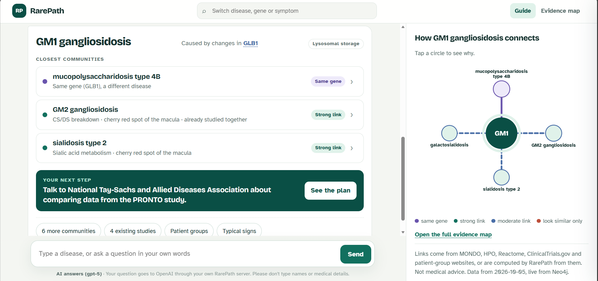
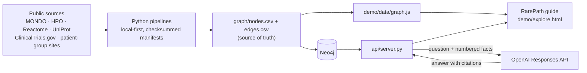
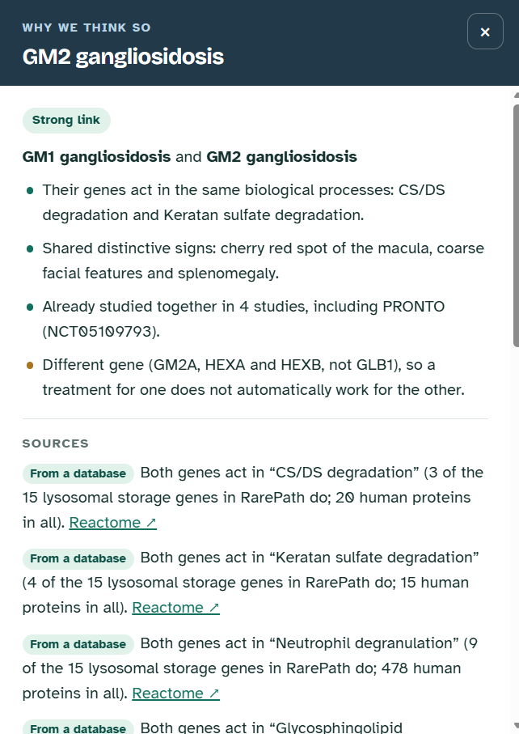
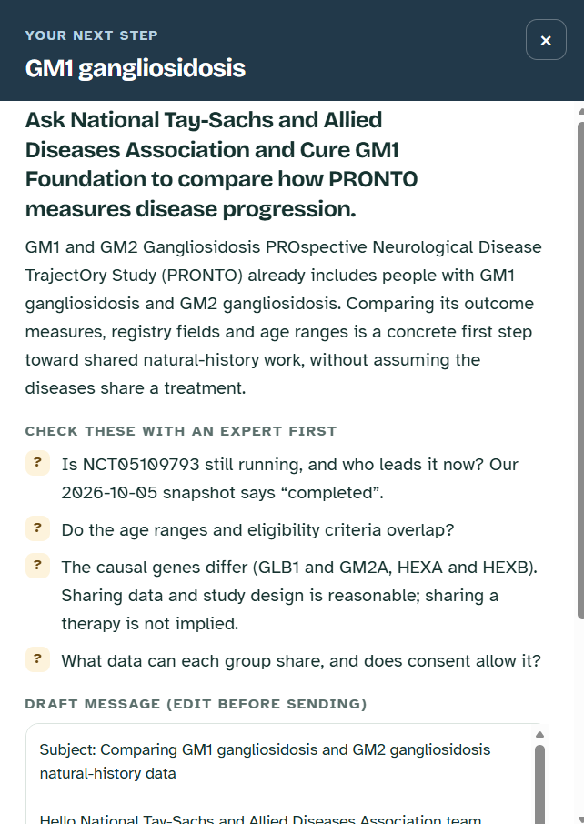
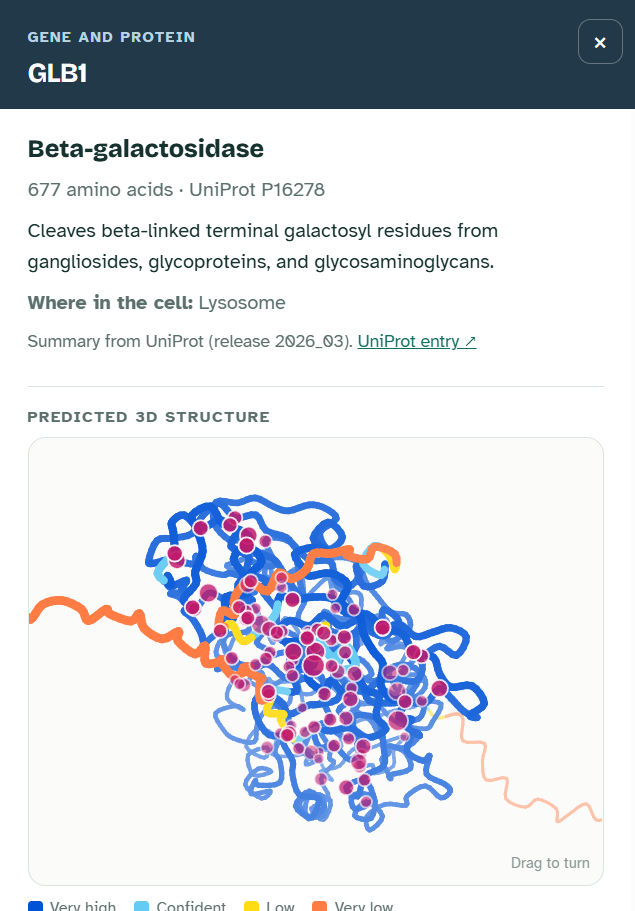

# RarePath: from a rare diagnosis to the people already working on it

**Type the name of a rare genetic disease. RarePath shows which other disease communities share its biology, which studies and patient groups already exist, and one concrete next step. Every link names its source.**

[](https://github.com/HuijiaoLuo/RarePath/actions/workflows/tests.yml) **[Open the app](https://huijiaoluo.github.io/RarePath/explore.html)** · **[Case study](https://huijiaoluo.github.io/RarePath/)** · [Limitations](#limitations) · [Data sources and licences](#data-sources-and-licences)



> **Research navigation, not medical advice.** RarePath is built on public, aggregate research data. It does not diagnose, predict how a disease will progress, decide who can join a study, or recommend treatments. A link between two diseases is a reason to compare research, not evidence that a treatment transfers.

## What it does

For each disease, RarePath shows:

- which other disease communities share its biology;
- which studies and patient groups already exist;
- one concrete next step, with a checklist and a draft message.

Anything RarePath computed is labelled as computed, and a disease that only *looks* similar is shown as a caution, never as a partner.

It covers 43 diseases in three families (lysosomal storage diseases, RASopathies and ciliopathies). They were chosen to test three claims: one gene can cause different diseases, different genes can disrupt the same process, and similar symptoms can have different causes.

## Highlights

- **Two signals, kept apart.** Mechanism (Reactome pathway overlap of the causal genes, weighted by rarity) and symptoms (simGIC over HPO) are scored separately. The relation class then comes from predeclared gates, so "look-alike, different mechanism" is a first-class answer rather than a false positive. See the [method notes](docs/CLUSTER_EXPANSION.md).
- **Checked against known biology.** 23 checks run on every build (`pipelines/check_cluster_benchmark.py`). For the RASopathy and ciliopathy families, 12 of them were written down before their data was scored, and all 12 held on the first run.
- **A review finding, fixed at the cause.** The predictions held, but reading every new pair showed that true relatives were sometimes called look-alikes. For example, PTPN11 and RAF1 act at different steps of one cascade and share no lowest-level Reactome pathway. Scoring v0.4 adds a weak link for diseases in the same mechanism-defined MONDO class. Now only 2 pairs are labelled look-alikes, both involving counterexamples I designed: Krabbe vs Canavan, and Bardet-Biedl 1 vs Prader-Willi. The third designed counterexample, Aarskog-Scott, is not similar enough in symptoms to Noonan 1 to count as a look-alike, so it stays unlinked. The communities are unchanged ([details](docs/CLUSTER_EXPANSION.md#why-v04-a-review-finding)).
- **Stable when the data grows.** Pathway rarity and symptom percentiles are measured within each disease family. When I added two families, the original 190 lysosomal pairs stayed identical, and a unit test guards that.
- **Grounded AI answers.** The chat sends the model only numbered facts from the graph. The model must cite them, and the server deletes any citation that doesn't match a fact (`api/chat.py`, OpenAI Responses API with a strict JSON schema and `store=False`). Without the server, the page answers offline from the same facts.
- **From disease to protein.** Clicking a gene name opens a panel with:
  - the protein's UniProt function summary;
  - the diseases the gene causes in RarePath;
  - its Reactome processes;
  - a protein comparison: HEXA and HEXB are 57.4% identical (E-value 1.8 × 10⁻¹⁷⁸) and their AlphaFold models superimpose to 0.865 Å over 483 confident residues. Pairs that align too little are shown as "not evaluated", never as "different";
  - a rotatable AlphaFold model coloured by confidence, with disease-causing ClinVar missense variants placed on it. A variant is placed only when its reference amino acid matches the model's sequence.

  The viewer is a small, dependency-free canvas script. The model is labelled as a prediction, and the variant pattern as descriptive ([details](docs/GENE_AND_VARIANT_LAYER.md)).
- **An evaluation set for the chat.** 17 fixed questions (answerable, not in the graph, treatment and eligibility, look-alikes and wrong-disease prompts) list the facts an answer must cite and the phrases it must never use, plus 5 system cases (forged citations, graph-version mismatch, no key, Neo4j down). Its first run caught six offline answers that guessed instead of saying "RarePath does not record this"; they now abstain ([`evals/`](evals/run_chat_eval.py)).
- **Privacy by design.** Feedback is one tap on a fixed category ("the link looks wrong") about a record ID, with no free text and no identity, and it goes to a review queue, never straight into the graph. Recent diseases are remembered only in the browser. Every answer and feedback record names the graph version it came from ([architecture](docs/ARCHITECTURE.md)).
- **Reproducible data.** Downloads are reused when present, written atomically and recorded with source versions and SHA-256 checksums. The graph's source of truth is two CSV files under version control, loaded into Neo4j.

## Three stories from the data

| Family | What RarePath shows | Try it |
| --- | --- | --- |
| Lysosomal storage | GM1 gangliosidosis's strongest neighbour is the GM2 group (a shared breakdown process and a cherry-red spot). A completed natural-history study (PRONTO, NCT05109793) already enrolled both. Reusing it instead of starting a new one could cut the time to comparable data from about 4 years to about 4 months. That is a hypothesis, with its assumptions listed for testing ([10× case](docs/TEN_X_CASE.md)). | [GM1](https://huijiaoluo.github.io/RarePath/explore.html?focus=MONDO:0018149) |
| Ciliopathies | One gene, CEP290, appears as three diseases: Joubert syndrome 5, Senior-Loken syndrome 6 and Meckel syndrome 4. Prader-Willi syndrome shares obesity and hypogonadism with Bardet-Biedl syndrome but is flagged as a look-alike. | [Joubert 5](https://huijiaoluo.github.io/RarePath/explore.html?focus=MONDO:0012432) |
| RASopathies | Noonan, Costello, CFC, Legius syndromes and NF1 involve different genes in one pathway, and a recruiting RASopathy biorepository (NCT04395495) covers five of them. Aarskog-Scott syndrome has a Noonan-like face but is kept apart. | [Noonan 1](https://huijiaoluo.github.io/RarePath/explore.html?focus=MONDO:0008104) |

Studies and patient organisations for the newer families are hand-checked against their official pages, with the check date stored in [`data/curated/family_resources.csv`](data/curated/family_resources.csv).

## How it works



| Step | Script | Output |
| --- | --- | --- |
| Fetch | `pipelines/fetch_cluster_expansion.py` | panel resolved to MONDO, HPO annotations, causal genes, Reactome pathways |
| Score and cluster | `pipelines/compute_disease_similarity.py` | pair scores, relation classes, Louvain clusters |
| Check | `pipelines/check_cluster_benchmark.py` | known-biology checks and predeclared predictions |
| Graph | `pipelines/sync_cluster_to_graph.py`, `pipelines/sync_curated_resources.py` | `graph/nodes.csv`, `graph/edges.csv` |
| Serve | `graph/load_neo4j.py`, `graph/export_graph_json.py`, `api/server.py` | Neo4j, static data file, local API |

The protein layer (`pipelines/compute_protein_similarity.py`) adds Smith-Waterman alignments with Karlin-Altschul E-values and AlphaFold structure comparisons for the GM1/GM2 genes ([notes](docs/PROTEIN_SIMILARITY_PORTFOLIO.md)).

## Run it

The quickest way is the [hosted app](https://huijiaoluo.github.io/RarePath/explore.html), a static copy of `demo/` on GitHub Pages. It has everything except live AI answers: the chat answers offline from the same facts, and feedback opens a prefilled GitHub issue. Locally, open `demo/explore.html` in any browser; it needs no install. Add `?focus=` and a MONDO ID to start at a disease, for example `explore.html?focus=MONDO:0018149` for GM1.

For AI answers and live Neo4j data:

```bash
python -m pip install -r requirements.txt
python api/server.py            # then open http://127.0.0.1:8000/explore.html
```

The server reads `OPENAI_API_KEY` (optionally `OPENAI_MODEL`, default `gpt-5`) and `NEO4J_*` from the environment. If either is missing, the page falls back to the exported snapshot and offline answers.

To rebuild the data:

```bash
python pipelines/fetch_seed_data.py      # Mondo, ClinVar, ClinicalTrials.gov seed (GM1/GM2)
python pipelines/build_atlas.py          # fetch (diseases, genes, AlphaFold, ClinVar) -> score -> check -> graph -> page
python graph/load_neo4j.py --load --prune
python -m unittest                       # 71 tests
```

To add a disease, add one line to `PANEL` in `pipelines/fetch_cluster_expansion.py` and re-run. Mondo is never re-downloaded unless you pass `--download-mondo`.

## Repository map

```text
demo/       case-study page (index.html), RarePath guide (explore.html, plain JavaScript and SVG), exported graph data
api/        local server: page + live Neo4j + grounded chat + feedback
graph/      graph CSVs (source of truth), schema, Neo4j loader, JSON export
pipelines/  data fetch, disease similarity, known-biology checks, graph sync, protein layer
data/       processed tables, curated resources and manifests (raw downloads are git-ignored)
rag/        corpus builder, BM25 retriever, OpenAI candidate extraction into a review queue
docs/       method notes
evals/      fixed chat questions, the facts the page sends, and the scorer
tests/      unit and end-to-end tests
```

## Further reading

- [Method: mechanism and symptom scoring, clustering, checks](docs/CLUSTER_EXPANSION.md)
- [The 10× case](docs/TEN_X_CASE.md): a hypothesis that reusing existing studies could bring comparable natural-history data in months instead of years, with the assumptions still to validate
- [Gene, protein and variant layer](docs/GENE_AND_VARIANT_LAYER.md): UniProt summaries, AlphaFold models and ClinVar variants
- [Architecture](docs/ARCHITECTURE.md): the evidence graph, the LLM and user data kept apart, and how that would grow
- [Demo candidate](docs/DEMO_CANDIDATE.md) and [user test protocol](docs/USER_TEST_PROTOCOL.md): how a build is frozen and tested with people
- [Changelog](CHANGELOG.md): what changed and why, version by version
- [Protein similarity](docs/PROTEIN_SIMILARITY_PORTFOLIO.md): sequence and structure comparison of GLB1, HEXA, HEXB and GM2A
- [Seed evidence table](docs/SEED_EVIDENCE_TABLE.md), [data pipeline](docs/DATA_PIPELINE.md) and [graph schema](graph/schema.md)
- [1-minute walkthrough](docs/DEMO_SCRIPT.md) and [all documents](docs/README.md)

## Data sources and licences

The Apache-2.0 licence in [`LICENSE`](LICENSE) covers RarePath's original code and documentation. Third-party data keeps its own terms, so the repository does not relicense it:

- **Mondo** (release v2026-09-01) is CC BY 4.0. **HPO** (v2026-09-01) may be used with acknowledgement, citation and its version shown wherever it is displayed, and must not be altered; both RarePath pages show the HPO credit and version.
- **Reactome** data files are CC0; attribution is encouraged. Reactome software, illustrations and branding have separate terms.
- **UniProt** (release 2026_03) is CC BY 4.0; its copyright statement is reproduced in the sources document, and accessions and release are kept.
- **AlphaFold DB** models are CC BY 4.0 and require attribution to AlphaFold DB, EMBL-EBI and Google DeepMind.
- **ClinVar** is publicly reusable with attribution requested; submitter credit and record accessions remain part of the provenance.
- **ClinicalTrials.gov** records are shown with their NCT ID, source link and retrieval date, and with the fields RarePath changed stated; status and eligibility must be checked on the live record.

The complete source list, snapshot versions, citations and official terms are in [Sources and attribution](docs/SOURCES_AND_ATTRIBUTION.md).

Each part of the answer opens a panel:

| Why we think so | Your next step | Gene and protein |
| --- | --- | --- |
|  |  |  |
| Every reason, what differs, and the sources behind it | One step, what an expert must check, and a draft message | UniProt summary, AlphaFold model and ClinVar variants |

## Limitations

What RarePath can and cannot support today:

- **Small, hand-picked panel.** 43 diseases in three families, chosen to test the method. Links to diseases outside the panel do not exist yet.
- **Coarse biology.** Mechanism similarity uses Reactome pathway membership of the causal genes, which is coarse; symptom similarity depends on how completely HPO annotates each disease. The thresholds for relation classes were tuned on these families and checked by 23 known-biology checks, 12 of them written before their data was scored. They are not validated beyond these families.
- **Protein comparison covers four proteins.** Sequence and structure comparison was run for GLB1, HEXA, HEXB and GM2A only (6 pairs). One pair, HEXA–HEXB, could be superimposed; the other five are "not evaluated", not "different". AlphaFold models are predictions, not experimental structures.
- **Variants are descriptive.** ClinVar missense records show where reported variants cluster on a protein, not how common they are in patients, and nothing about a single person's variant.
- **Studies and groups are snapshots.** Study status was retrieved on 2026-10-03 to 2026-10-05 and can change; patient organisations were checked by hand and some communities have none listed.
- **The 10× case is a hypothesis.** The estimate that reusing an existing study could bring comparable data in months rather than years has not been tested with a patient group ([assumptions](docs/TEN_X_CASE.md)).
- **No user testing yet.** The [test protocol](docs/USER_TEST_PROTOCOL.md) is ready; nobody outside the project has used RarePath in a structured session. The first informal use on the hosted site already found one bug (an answer about the wrong disease), now fixed.
- **Chat answers.** On the hosted site, answers come from keyword rules over the facts, not a language model, so unusual phrasings can get a generic reply. The AI mode was checked on 15 fixed questions over three runs of one model (gpt-5), judged by the author only; two more questions test the page's wrong-disease check.
- **Not reviewed by clinicians or by patient organisations,** and available in English only.

Built by Huijiao Luo.
