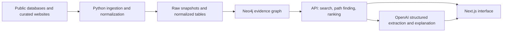

# Rare Disease Atlas - Team Overview

## 1. Product in one sentence

Build an **evidence-first collaboration navigator** for rare-disease patient organizations: starting from a disease, it identifies well-supported related disease communities, reusable research assets, relevant collaborators, and a concrete next step.

The product should not claim that a treatment will work. It should make research connections understandable, show where the evidence comes from, identify uncertainty, and help a patient group prepare an informed collaboration proposal.

## 2. What we need to demonstrate

For the hackathon, we should focus on one complete, real-world journey rather than attempting to cover every rare disease:

> Search for disease A -> discover disease B -> understand the shared mechanism and the important differences -> find an existing registry, study, or research group -> produce a sourced next action.

We should also include one counterexample: a disease that looks similar by symptoms but should **not** be treated as a close research match because its mechanism or evidence differs. This demonstrates that the system handles uncertainty responsibly.

### The three user questions

1. **Who shares our disease characteristics?**
2. **What useful work already exists?**
3. **What should we do together next?**

## 3. MVP scope

Start with a small, evidence-rich disease cluster:

- 5-10 diseases or disease subtypes;
- one reasonably clear biological mechanism or pathway;
- a small, curated set of papers and public database records;
- at least one real patient organization, research asset, and possible collaborator;
- one verified positive path and one negative/cautionary path.

The first selection criterion is not disease popularity. It is whether we can support an end-to-end story with real biology, literature, community, and research-resource data.

## 4. Core experience

The interface should have four simple surfaces.

| Surface | What it does |
| --- | --- |
| **Global search** | Searches disease names, synonyms, genes, phenotypes, mechanisms, and organizations. |
| **Disease overview** | Shows the selected disease, genes, major phenotypes, and current evidence coverage. |
| **Connection opportunity** | Explains a related disease cluster, the supporting evidence, key differences, and confidence. |
| **Action plan** | Shows patient organizations, investigators, registries, studies, reusable assets, and the next question to validate. |

The graph is the engine, not the entire experience. We should display only the 10-20 nodes relevant to the current path and let users expand details progressively.

## 5. Data plan

### Stable identifiers

Every entity needs a canonical identifier so that different source names resolve to the same thing.

| Entity | Preferred identifier |
| --- | --- |
| Disease | MONDO ID |
| Phenotype | HPO ID |
| Gene | HGNC ID or NCBI Gene ID |
| Variant | ClinVar Variation ID plus HGVS where available |
| Publication | PMID, PMCID, DOI |
| Clinical study | NCT ID |
| Researcher | ORCID when available |
| Organization | Official URL; ROR for research institutions where available |

### Recommended sources

| Need | Source | Use in the MVP |
| --- | --- | --- |
| Disease names, synonyms, and cross-references | [MONDO](https://mondo.monarchinitiative.org/pages/download/) | Canonical disease nodes and name resolution. |
| Disease-gene-phenotype relationships | [Monarch Knowledge Graph](https://monarch-app.monarchinitiative.org/) and HPO | Build the initial biology graph and phenotype similarity features. |
| Variant-level evidence | [ClinVar](https://www.ncbi.nlm.nih.gov/clinvar/docs/access/) | Add variants, associated conditions, clinical significance, and review status. |
| Papers and investigators | [PubMed E-utilities](https://www.ncbi.nlm.nih.gov/books/NBK25501/) | Search papers by disease, gene, and mechanism; retrieve metadata and abstracts. |
| Open full text | PMC Open Access material | Extract claims only where the article license permits reuse. |
| Trials and natural-history studies | [ClinicalTrials.gov](https://clinicaltrials.gov/data-about-studies/csv-download) | Add NCT IDs, status, intervention, eligibility, outcomes, and study design. |
| Funding and active programs | [NIH RePORTER API](https://api.reporter.nih.gov/?urls.primaryName=V2.0) | Find funded projects, principal investigators, institutions, and research abstracts. |
| Patient organizations and registries | NORD, Global Genes, Orphanet, verified organization sites | Curate a small set of real organizations, registries, and contact pages. |

For the prototype, patient organization data should be curated manually and linked back to official pages. Do not bulk-copy website content. Orphanet's website terms differ from its licensed data products; check the relevant [Orphanet terms of use](https://www.orpha.net/en/other-information/about_orphanet?stapage=cgu) before bulk ingestion.

### Source provenance is mandatory

Every imported or generated fact must retain:

```text
source_id          # PMID, NCT ID, ClinVar ID, source record ID, etc.
source_url
source_version_or_date
retrieved_at
evidence_excerpt   # where applicable
license_note
```

Store raw responses unchanged in `data/raw/`; generate cleaned, normalized records in `data/processed/`. This makes the demo reproducible and makes data corrections possible.

## 6. Knowledge graph model

The graph must retain the path from a conclusion back to its source.

```text
Disease  --has_phenotype-->             Phenotype
Disease  --associated_with-->            Gene
Variant  --affects-->                    Gene
Variant  --supports_mechanism-->         Mechanism
Gene     --participates_in-->            Pathway
Paper    --supports / refutes-->         Claim
Study    --studies-->                    Disease
Study    --tests-->                      Intervention
Organization --supports-->               Disease
Organization --operates-->               Registry
Researcher --authored-->                 Paper
Researcher --leads-->                    Grant or Study
```

Every relationship should have these fields:

```text
relation_type
assertion_level: curated | extracted | inferred | human_reviewed
source_ids
evidence_excerpt
retrieved_at
confidence
contradictory_evidence_ids
limitations
```

`Confidence` should mean confidence in the relationship given the available evidence. It must never be presented as the chance that a therapy will succeed.

## 7. How we rank candidate connections

We should never rank diseases on symptom overlap alone. The initial candidate score can combine:

```text
candidate score =
    mechanistic consistency
  + phenotype similarity weighted by HPO specificity
  + shared-resource availability
  + directness and strength of evidence
  - contradiction and mechanism-conflict penalties
```

- **Mechanistic consistency:** shared pathway or compatible functional effect is stronger than merely sharing a gene name.
- **Phenotype similarity:** broad terms such as "developmental delay" should have much lower value than distinctive, specific HPO terms.
- **Shared-resource availability:** active registries, natural-history studies, models, or patient organizations increase actionability.
- **Evidence strength:** prioritize structured curated sources and independent publications.
- **Conflict penalty:** decrease the score when the proposed relationship has a different variant effect, incompatible mechanism, or contradictory evidence.

The user should see the components of the score in plain language, not just a number.

## 8. Proposed technical architecture



| Layer | Recommended choice |
| --- | --- |
| Front end | Next.js, TypeScript, Tailwind CSS |
| Graph visualization | Cytoscape.js or React Flow |
| API | FastAPI in Python, or Next.js route handlers for a smaller build |
| Data processing | Python, Pandas, Pydantic, Neo4j driver |
| Graph store | Neo4j |
| Raw and processed source data | Versioned local files for the prototype; object storage later |
| Deployment | Vercel plus Neo4j Aura, or a simple local Docker setup for judging |

Suggested repository layout:

```text
apps/web/                 # Search, disease view, graph, evidence and action screens
services/api/             # Search, graph traversal and ranking endpoints
pipelines/fetch/          # Source-specific data retrieval
pipelines/normalize/      # Canonical IDs and source transformation
pipelines/extract/        # Literature claim extraction
pipelines/load_graph/     # Neo4j import
data/raw/                 # Immutable downloaded/API snapshots
data/processed/           # Generated normalized nodes and edges
schema/                   # Graph and evidence specifications
```

## 9. The role of OpenAI

OpenAI should support the evidence workflow, not replace scientific judgment.

1. **Structured extraction** - Extract genes, variants, mechanisms, claims, limitations, and evidence excerpts from abstracts or reusable full text.
2. **Evidence-grounded explanation** - Turn retrieved graph paths into family-friendly language, while citing every step.
3. **Action-brief drafting** - Draft a collaboration brief using only selected, verified graph facts.

Use a strict JSON schema for extraction. The [Structured Outputs guide](https://developers.openai.com/api/docs/guides/structured-outputs) describes enforcing schema-conformant model outputs.

Example extraction record:

```json
{
  "claim": "Variants in gene X impair lysosomal transport.",
  "subject_id": "HGNC:...",
  "predicate": "impairs",
  "object_id": "mechanism:lysosomal_transport",
  "evidence_excerpt": "...",
  "pmid": "12345678",
  "assertion_type": "reported_finding",
  "limitations": ["Cell model only"],
  "requires_review": true
}
```

The model must only explain facts supplied by the retrieval layer. It must not invent missing biomedical evidence or make clinical recommendations.

## 10. 24-hour execution plan

| Time | Deliverable |
| --- | --- |
| Hours 0-2 | Choose the disease cluster, the positive path, and the counterexample. |
| Hours 2-6 | Retrieve seed data from MONDO, HPO/Monarch, ClinVar, PubMed, and ClinicalTrials.gov. |
| Hours 6-10 | Normalize IDs; model nodes, edges, claims, and evidence; load the graph. |
| Hours 10-14 | Build search, path traversal, candidate ranking, and evidence APIs. |
| Hours 14-18 | Build the four core product screens and graph interaction. |
| Hours 18-21 | Add OpenAI extraction and evidence-grounded explanations. |
| Hours 21-24 | Human-review the demo path, write the README, and record the walkthrough. |

## 11. Definition of a strong demo

A strong demo makes one concrete statement that judges can inspect:

> "This patient organization should investigate collaboration with this related community because both conditions have evidence for a compatible mechanism. The related community already has this registry or study design. These differences must be reviewed by an expert before any joint study is proposed."

The demo succeeds if every part of that statement is clickable, sourced, and clearly distinguishes evidence from hypothesis.

