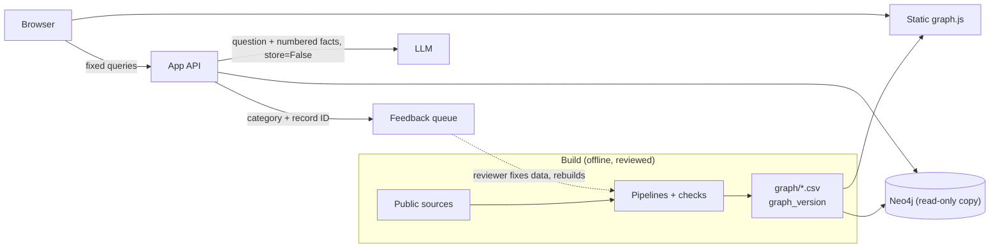

# Architecture: three kinds of state

RarePath keeps three kinds of state apart, because each changes at a different speed and carries a different risk.

| Layer | What it holds | Changes when | Risk to manage |
| --- | --- | --- | --- |
| Evidence graph | Diseases, genes, studies, groups and the links between them, each with a source | A reviewed pipeline run | A wrong link presented as fact |
| Explanation (LLM) | Nothing. It turns numbered facts into a plain-language answer | Every question | An answer that says more than its sources |
| People | Accounts, saved diseases, feedback, usage | Every visit | Health information about a family |

## Two ways to run it

The current version is a **demo candidate**: a frozen, checked build (`docs/DEMO_CANDIDATE.md`), not a hosted service. It runs in one of two modes.

| | Static mode | API mode |
| --- | --- | --- |
| How | Open `demo/explore.html`, or any static host | `python api/server.py` on your own machine |
| Graph | The exported snapshot (`demo/data/graph.js`) | Neo4j if configured, else the same snapshot |
| Search, evidence panels, map, next step, gene and protein panels | Yes | Yes |
| Chat answers | Offline answers built from the same facts | The OpenAI model with the server's key; offline answers if the call fails |
| Feedback | A prefilled GitHub issue (public; the page warns) | Stored on the server for review |
| Graph version shown | Yes, from the snapshot | Yes, and each answer names the server's version |

**What is never saved**, in either mode:

- Questions typed into the chat, and the answers. The server keeps no chat log. The model call uses `store=False`, and the page holds the conversation in memory only until it is closed.
- Who is using it. There are no accounts, cookies or analytics, and feedback records no IP address. (Two caveats: the pages load their fonts from Google Fonts, which sees the visitor's IP like any web request; and the local server prints standard request lines to its own console, which it does not write to disk.)

**What is saved, and where:**

- In the browser only: up to six recently viewed disease IDs (removable with "Forget").
- On the API server only: feedback records (a category and a record ID), in a git-ignored file.
- In the repository: review decisions about feedback (`data/curated/feedback_decisions.csv`), which hold record IDs, a status and the reviewer's note.

**What needs a database and accounts later**, and is deliberately not built yet:

- History and saved diseases that follow a person across devices.
- Per-person rate limits and spend caps for AI answers (today: one global feedback limit, and a key only the owner holds).
- Letting a person see, export or delete what was stored about them.
- Feedback from many testers stored durably, rather than in one local file.

## What is built today

- **The graph is the source of truth, under version control.** `graph/nodes.csv` and `graph/edges.csv` are built by the pipelines and checked by 23 known-biology checks. Neo4j is a copy loaded from them.
- **Graph version.** Every export carries `meta.graph_version`, a fingerprint of the graph's content (`graph/export_graph_json.py`), plus the method and source dates it was built from (`meta.build`). The same content always gives the same version, whether it comes from the CSVs or from Neo4j. The page footer shows it, and every AI answer and feedback record names the version it was based on. If the server's graph differs from the page's, the answer says so.
- **The LLM only explains.** It receives numbered facts from the graph and must cite them. The server removes any citation that does not match a fact (`api/chat.py`). Requests use `store=False`, and only the last few turns are sent. Without a key, the page answers from the same facts offline.
- **Feedback is a fixed category, never free text** (`POST /api/feedback`). It records a category (for example "the link looks wrong"), the ID of a record that exists in the graph, the disease being viewed and the graph version. It stores no IP address and no text, so it cannot hold health information. Records go to a git-ignored file. `pipelines/review_feedback.py` turns them into a review queue, and feedback never edits the graph: a reviewer fixes the data or pipeline and rebuilds. Without a server, the page offers a prefilled public GitHub issue instead and warns that issues are public.
- **History stays on the device.** The page remembers up to six recently viewed disease IDs in the browser's local storage, never questions or anything typed. "Forget" clears it.

## How it would grow

1. **Public portfolio (next; today it runs locally only).** A static host serves the page and `graph.js`. AI answers are off unless someone runs their own server with their own key. No database, no accounts.
2. **Invited testers.** A small app API with the chat behind rate limits, a monthly spend cap, timeouts and a separate project key. The model is chosen again for cost (gpt-5 is the local-demo choice) and the chat eval is re-run and hand-checked on it before anyone else uses it ([release checklist](RELEASE_CHECKLIST.md#6-before-making-the-site-public)); feedback stored in a managed Postgres. The graph can still be served from the static file: at 481 nodes it is about 0.7 MB.
3. **Many diseases.** When the graph no longer fits in one file, the browser stops loading it whole and calls fixed, parameterised queries (one disease's neighbours, one gene's diseases) on a read-only Neo4j user over an encrypted connection. Accounts (for saved diseases across devices) arrive here, with row-level security so each person sees only their own rows.

Design rules that hold at every stage:

- The browser never talks to the graph database or the LLM directly.
- Message text is health information. Store fact IDs and graph versions rather than the text, and keep any stored text for a fixed, short period.
- Feedback goes to people, not to the graph.
