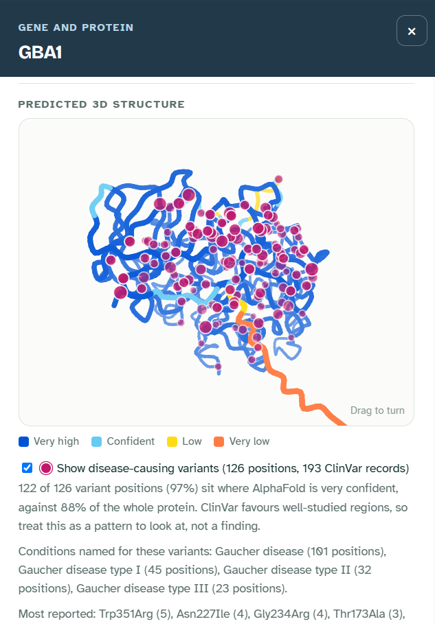

# Gene, protein and variant layer

Clicking a gene name in the guide (for example **GLB1** under GM1 gangliosidosis) opens a panel that answers a researcher's next questions:

- What does this protein do?
- What does it look like?
- Where do the disease-causing changes sit?

<em>GBA1 (Gaucher disease): 126 disease-causing missense positions, 97% of them where AlphaFold is very confident.</em>

| Section | Source | Script |
| --- | --- | --- |
| Protein name, length, function, location in the cell | UniProt (reviewed human entry) | `pipelines/fetch_gene_profiles.py` |
| Predicted 3D structure, coloured by confidence | AlphaFold DB, CC BY 4.0 | `pipelines/fetch_gene_profiles.py` |
| Disease-causing missense variants on the structure | ClinVar via NCBI E-utilities | `pipelines/fetch_clinvar_variants.py` |
| Diseases in RarePath caused by the gene | HPO gene-disease links | already in the graph |
| Biological processes | Reactome | already in the graph |
| Similar proteins | sequence and structure comparison | `pipelines/compute_protein_similarity.py` |

Both scripts run as part of `python pipelines/build_atlas.py`. They cache every response under `data/raw/` and accept `--offline` and `--refresh`.

## UniProt text

UniProt's curated comments are written for curators. The fetch step turns them into a short, readable summary:

- **Canonical protein only.** Comments tagged with an isoform are dropped when an untagged comment exists. Otherwise only the first isoform (normally the canonical sequence) is kept. This matters for GLB1: its second isoform is an elastin-binding protein with no enzyme activity, and an earlier version showed that text instead of the enzyme's.
- **Evidence codes stripped.** `{ECO:…}`, `(PubMed:…)`, `(By similarity)` and `(Probable)` are removed. The UniProt link next to the summary leads to the full, referenced text.
- **Locations shortened.** UniProt writes locations as paths ("Cytoplasm, cytoskeleton, cilium basal body"). Only the most specific step is kept, and membrane-topology terms ("Lipid-anchor", "Cytoplasmic side") are dropped.

## The 3D view

- **Model.** The AlphaFold DB model for the canonical UniProt sequence, used only if a single full-length model exists. Very long proteins (NF1, ALMS1) are predicted in fragments, so their panels say so instead of showing pieces.
- **What is stored.** Only the C-alpha trace (centred, in 0.1 Å units) and the per-residue confidence (pLDDT) go into `data/processed/gene_structures.json`, about 8 KB per protein. The page loads this file (`demo/data/structures.js`) only when a gene panel opens.
- **Viewer.** A small canvas script with no external library:
  - a smoothed backbone, shaded so that nearer parts look closer;
  - drag to turn;
  - framed on the confidently predicted core, so a floppy tail does not shrink the protein;
  - automatic turning stops when the user prefers reduced motion.
- **Colours.** AlphaFold's own scale: very high (pLDDT ≥ 90), confident (70–90), low (50–70), very low (< 50). The panel says the model is a prediction and that very-low regions should not be read literally. For full detail it links to AlphaFold DB's viewer.

## ClinVar variants

**Search.** For each gene with a structure: `GENE[gene] AND (clinsig_pathogenic[prop] OR clinsig_likely_pathogenic[prop])`, up to 5,000 records. Summaries are fetched in batches of 200, within NCBI's rate limits; setting `NCBI_API_KEY` allows faster requests.

**Filters.** A record must pass all of these:

1. Its germline classification is Pathogenic, Likely pathogenic, or Pathogenic/Likely pathogenic.
2. It is a single-nucleotide **missense** change.
3. ClinVar's preferred name is written on this gene's transcript. ClinVar also lists overlapping genes (read-through transcripts, antisense loci), so "names only this gene" would wrongly drop genes like GLA, GBA1 and HRAS.
4. ClinVar's preferred name gives a protein change, e.g. `NM_000404.4(GLB1):c.817T>C (p.Trp273Arg)`.
5. **The reference amino acid matches the AlphaFold model's sequence at that position.** A variant named on another transcript therefore never lands on the wrong residue. Mismatches are counted in `data/manifests/gene_variants_v0.1.json`.

**Numbering shifts.** ClinVar names variants on its preferred (usually MANE Select) transcript. That transcript can number residues differently from UniProt's canonical sequence: for ARSA, ClinVar's transcript is 2 residues longer at the start. For each gene, the script tests constant shifts of up to ±60 residues. It applies one only when:

- the unshifted numbering explains less than half of the variants;
- the shift explains at least 90% of at least 10 variants.

Variant names keep ClinVar's numbering, and the panel explains the shift.

**Large batches.** NCBI refuses summary batches above 10 MB. The script then splits the batch in two and retries, and it never caches an error response.

**In the viewer.** Variant positions are magenta dots. Larger dots are nearer, or have several ClinVar records. Hovering shows the change, the number of records and AlphaFold's confidence at that residue. A checkbox hides them.

**One descriptive question.** Do disease-causing missense changes sit mostly where AlphaFold is very confident (pLDDT ≥ 90), i.e. in the well-folded parts of the protein?

**How it is compared.** Genes differ a lot in how much of the protein is very confident: 94% of ARSA, but 0% of CEP290. A pooled share would mostly reflect which genes have many variants, so it is not a fair test. The fair comparison is within each gene: if a gene's variant positions were a random sample of its residues, how many would fall in very-high-confidence regions? The expected counts are summed over genes and compared with what is observed. The spread uses the hypergeometric variance, also summed over genes.

**Results** (ClinVar snapshot of 2026-10-05; 2,633 missense records at 1,549 positions in 32 proteins):

| Family | Positions in very-high regions | Expected if random within each gene | Observed / expected | z |
| --- | --- | --- | --- | --- |
| Lysosomal storage (15 genes) | 1,065 | 974.9 | 1.09 | 8.7 |
| RASopathies (9 genes) | 156 | 143.1 | 1.09 | 1.7 |
| Ciliopathies (8 genes) | 80 | 52.1 | 1.53 | 6.3 |
| **All** | **1,301** | **1,170.1** | **1.11** | **9.7** |

The raw pooled shares (84% of variant positions against 55% of all residues) overstate the effect for the reason above, so the panel and the docs use observed versus expected.

**What it shows:**

- **Enriched, but modestly.** Disease-causing missense changes sit in confidently predicted regions about 10% more often than chance within each gene. Lysosomal enzymes are already mostly well folded (81% of residues), so they leave little room above chance, even though their variants are 92% in very-high regions.
- **Ciliopathy proteins show the clearest enrichment.** Only 32% of their residues are very confident. BBS10 and INPP5E have 86% and 100% of their variant positions in very-high regions, against 40% and 50% of the protein.
- **Two RASopathy genes go the other way.**
  - **RAF1:** 18% of variant positions in very-high regions, against 31% of the protein. Its most reported positions are Ser257–Val263 (pLDDT 61–76). This is consistent with the known cluster of Noonan-associated RAF1 changes in conserved region 2 around Ser259: a regulatory segment, not the folded kinase domain.
  - **SOS1:** 37% against 49%.
  - In RASopathies, many disease variants switch signalling on rather than break a fold. That is a reasonable explanation, but this analysis does not test it.

**Caveats.** This is descriptive and exploratory:

- ClinVar over-represents well-studied genes and regions.
- Variant positions within a protein are not independent: hot spots and domains cluster.
- AlphaFold confidence is itself higher in conserved domains, where disease variants are more often classified as pathogenic.
- The z-scores describe how surprising the counts are under the simple within-gene null model; they are not evidence of a mechanism.

## Limits

- One structure per protein, for the canonical isoform. Other isoforms and protein complexes are not modelled. GLB1, for example, works in a complex with CTSA and NEU1.
- Missense variants only. Truncating, splice and structural variants matter just as much clinically, but have no single position to draw.
- ClinVar classifications change. The panel shows a dated snapshot and links to the live record.
